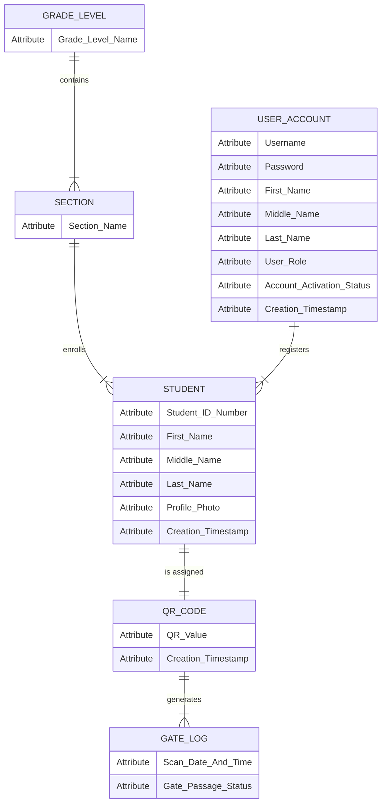

# SCHOOL ENTRANCE MONITORING SYSTEM (SEMSYSTEM)

**Project Team Members:**
- Christine Rose Pahis
- Steven Ochigue
- Kent Lloyd Valmores

---

## 1. DESCRIPTION OF THE SYSTEM

The School Entrance Monitoring System (SEMSYSTEM) is an integrated, web-based gate management and attendance tracking platform designed to automate student access verification and real-time record-keeping for San Isidro National High School. The system utilizes dedicated Quick Response (QR) Code scanning paired with USB QR Code scanners (and manual Student ID lookup fallbacks) to capture and process student entry and exit events at school gates in real time. Upon scanning a student's assigned QR code ID, SEMSYSTEM automatically validates the student's registration status, evaluates their last gate passage state, and executes an automated toggle state machine: registering an ENTRY (Time-In) if the student is currently outside, or registering an EXIT (Time-Out) if the student is currently inside. The gate terminal immediately provides visual confirmation (displaying the student's photo, complete name, grade level, section, and Time-In/Time-Out status) alongside audio chimes for visual verification. Behind the gate interface, SEMSYSTEM equips System Administrators with a centralized management portal to manage student profiles (CRUD operations), issue QR codes, control user access, and generate filterable attendance reports across daily, weekly, monthly, and yearly timeframes with instant PDF and Excel export capabilities.

---

## 2. SERVICES INCLUDED IN THE SCOPE

1. **Gate Access & Real-Time Monitoring Service**
   * Real-time automated tracking and verification of student campus entry and exit passages at the school gate.
2. **Student Information & Academic Registration Service**
   * Centralized management (Add, Edit, Update, Delete) of student profiles, Student IDs, photographs, grade levels, and section allocations.
3. **Digital QR Code Identification Service**
   * Automated generation and rendering of unique QR code credentials linked to student IDs for printing and badge assignment.
4. **Automated Attendance State Machine & Audit Service**
   * Sequential state tracking (Time-In vs. Time-Out) with tamper-proof timestamps recorded automatically upon every scan.
5. **Attendance Analytics & Compliance Reporting Service**
   * Dynamic administrative dashboards and historical log reporting filterable by date range, grade, section, and status with PDF/Excel exports.
6. **System Administration & Access Control Service**
   * Secure local account management providing role-restricted access to system administrators.

---

## 3. USER STORIES (SCHOOL ICT COORDINATOR)

* **US-01 (Student Profile CRUD Management):** As a School ICT Coordinator, I want to add, edit, update, and delete student records (including Student ID, full name, grade level, section, and photo) so that student registration records remain accurate and up to date.
* **US-02 (Bulk Student Import):** As a School ICT Coordinator, I want to import student lists via Excel files (.xlsx/.csv) so that multiple student profiles can be registered into the system efficiently.
* **US-03 (QR Code Generation & Badge Printing):** As a School ICT Coordinator, I want the system to automatically generate unique QR codes for registered students so that digital IDs can be printed and issued.
* **US-04 (Real-Time Gate Monitor View):** As a School ICT Coordinator, I want to view a real-time attendance monitor stream on screen showing student photos, complete names, grade levels, sections, and Time-In/Time-Out timestamps as students scan at the gate.
* **US-05 (User Account Management):** As a School ICT Coordinator, I want to create, update, and manage user accounts so that system access is secure and authenticated.
* **US-06 (Multi-Period Attendance Reporting):** As a School ICT Coordinator, I want to filter and generate attendance reports across daily, weekly, monthly, and yearly timeframes so that official attendance trends can be evaluated.
* **US-07 (Report Exporting):** As a School ICT Coordinator, I want to export attendance logs and summary reports to Excel spreadsheets and printable PDF formats so that official physical records can be archived or presented to DepEd.

---

## 4. FUNCTIONALITIES OF THE SYSTEM

| Module Name | User Role | Key Functional Capabilities |
|---|---|---|
| **1. Authentication & System Control** | School ICT Coordinator | Secure local login using system credentials (`username` & `password`). Protected system routes and session control. |
| **2. Student Profile Management (CRUD)** | School ICT Coordinator | Complete CRUD capabilities: Add new students, Edit/Update details, upload photos, reassign Grade (7–12) & Section, or Delete records. Includes bulk Excel (.xlsx/.csv) import. |
| **3. Dynamic QR Code Generator** | School ICT Coordinator | Automatic generation of unique QR payload strings (`STU-{Student_ID}`). Printable QR badge rendering and auto-healing code display. |
| **4. Real-Time Gate Scanner Terminal** | School ICT Coordinator | Fast scanning via USB QR Code scanner (or manual Student ID lookup fallback). Displays student picture, full name, grade level, section, and Time-In/Time-Out status with audio chime confirmation. |
| **5. Automated State Machine Logging** | System Automated | Automatic state evaluation based on last scan log: toggles from ENTRY (Time-In) to EXIT (Time-Out) with high-precision timestamp persistence into the database. |
| **6. Administrative Dashboard & Analytics** | School ICT Coordinator | Real-time statistical counters (Total Registered Students, Students Currently Inside, Daily Entries/Exits) and live scan stream. |
| **7. Multi-Period Attendance Reporting** | School ICT Coordinator | Interactive attendance log filterable by date, grade level, section, and status. Supports Daily, Weekly, Monthly, and Yearly report generation with PDF and Excel exports. |

---

## 5. LEVEL 1 CONCEPTUAL ENTITY-RELATIONSHIP DIAGRAM (ERD)

*(Note: In accordance with Conceptual Modeling standards, Primary Keys [PK], Foreign Keys [FK], and technical SQL data types are omitted, focusing strictly on business entities, conceptual attributes, and operational relationships based on `database.sql`).*

### Conceptual Entity & Attribute Inventory

1. **`USER_ACCOUNT`** *(Table: `users`)*
   * **Attributes:** Username, Password, First Name, Middle Name, Last Name, User Role, Account Activation Status, Creation Timestamp
2. **`GRADE_LEVEL`** *(Table: `grade_levels`)*
   * **Attributes:** Grade Level Name *(e.g., Grade 7, Grade 11)*
3. **`SECTION`** *(Table: `sections`)*
   * **Attributes:** Section Name *(e.g., Diamond, GAS-A)*
4. **`STUDENT`** *(Table: `students`)*
   * **Attributes:** Student ID Number, First Name, Middle Name, Last Name, Profile Photo, Creation Timestamp
5. **`QR_CODE`** *(Table: `qr_codes`)*
   * **Attributes:** QR Value, Creation Timestamp
6. **`GATE_LOG`** *(Associative Entity - Table: `gate_logs`)*
   * **Attributes:** Scan Date & Time, Gate Passage Status *(ENTRY / EXIT)*

---

### Conceptual Relationship Rules & Associative Entity Discussion

* **`GRADE_LEVEL` contains `SECTION` (1-to-Many):** One Grade Level contains multiple class sections. Each section belongs to exactly one Grade Level.
* **`SECTION` enrolls `STUDENT` (1-to-Many):** One Section enrolls multiple students. Each student belongs to one designated class section.
* **`USER_ACCOUNT` registers `STUDENT` (1-to-Many):** One System User Account (School ICT Coordinator) registers and manages multiple student records in the database.
* **`STUDENT` is assigned `QR_CODE` (1-to-1):** Each enrolled student is assigned exactly one unique QR Code credential.
* **`GATE_LOG` as an Associative Entity (1-to-Many):** `GATE_LOG` functions as an **Associative Entity** linking a student's assigned `QR_CODE` with their real-time gate passage events, recording the `Scan Date & Time` and `Gate Passage Status (ENTRY / EXIT)` for every scan event.

